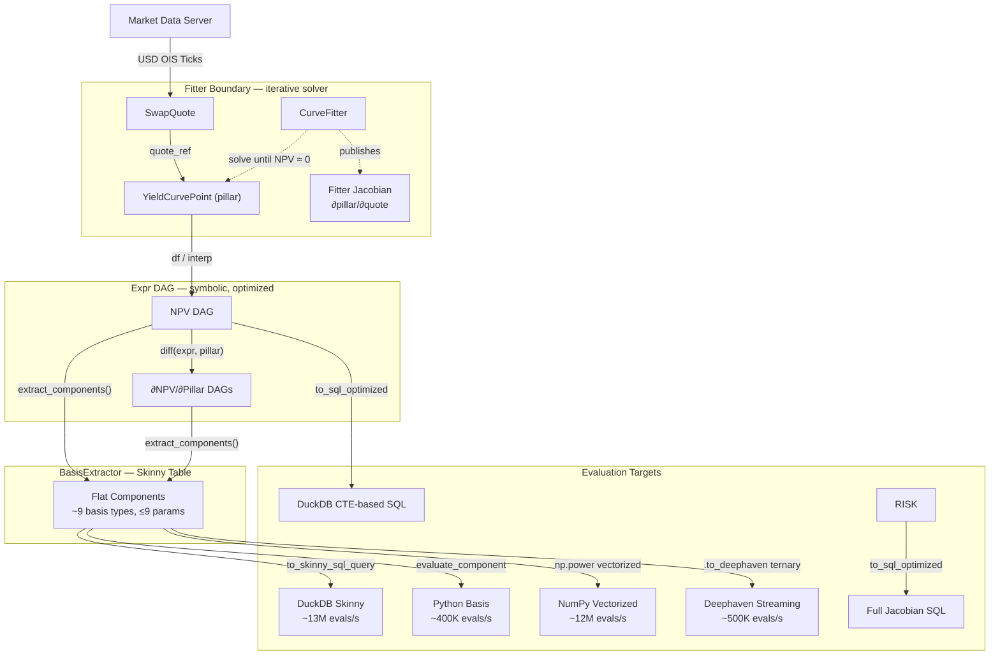

# Interest Rate Swap (IRS) Pricing & Risk Demo

This demo showcases a pricing and risk engine for Interest Rate Swaps in `py-flow`. It leverages an expression-tree that supports both native Python evaluation or DAG-aware SQL generation. The system can calculate analytic derivatives risk and curve fitting.  It should be able to scale.


Instruments: payoffs for Fixed Float swaps and Float-Float XCCY swaps.
Curves: two example yield curve interpolations: simple and smooth, to demonstrate composable models of market data that are switchable across instruments.
Risk: provides automatic differentiation, used to demonstrate multi-curve fitting to market quotes and generate portfolio risk. Provides jacobian to translate risk back through the fitter.
Performance & Scalability: Decomposed instrument expression trees into "Basis Function" enabling vectorized math in DuckDB (SQL-based, skinny tables), NumPy (ND-Array compiled Python), or Deephaven (native JVM expressions).


## Key Methodology
### 1. Explicit Expression Tree
The library started by Quants writing simple reactive pricing functions, that calculate for a single numerical tick. Then using AST to parse the pricing code into an expression tree. That parsing can get complex for richer payoffs, for example across instruments and curves. This demo propose a way to write very similar code that operates directly on expression objects, that can then be evaluated as single ticks or converted for other uses. The two routes generate the same Expr tree, so can be mixed. The end of this document discusses some similar approaches in other libraries.

### 2. Expression Tree Simplification

The Expr trees can be large: e.g. accidentally from simple for loop sums generating nested brackets around binary sums. We introduce some symbolic simplification.  Some are less obvious, for example swap float legs on simple scheduling, where we implement both the explicit approximation where a strip of 
 `rate * df * dcf` collapse to discount factor start and end, and the full version for split funding curves, and future accurate scheduling.

### 3. Jacobian Pruning
The engine uses **Symbolic Differentiation** to compute the full Jacobian matrix ($\partial NPV_i / \partial Pillar_j$).
- **Analytic Risk**: Sensitivities are computed exactly without the overhead of finite difference (bump-and-grind).
- **Pruning**: Columns with guaranteed zero sensitivity (e.g., a 1Y swap is not sensitive to the 30Y pillar) are automatically pruned from the SQL generation. This minimizes data transfer and simplifies the final query result.

### 4. Basis Function Decomposition
We have SQL CTEs to evaluate the Expr tree efficiently, caching in similar way to Python memorising shared nodes in the Expr tree.  But it still had large SQL volume as portfolios grow. Instead we can consider the Expr tree as a collection of parameterised mini-functions, with varied inputs, some constant from trade booking data, some ticking with market data. 
`BasisExtractor` decomposes the Expr tree into a flat "skinny table" of atomic parameterised functions. This helps:
- **Parallelism**: Decomposing 10,000 swaps into ~1M atoms allows NumPy and DuckDB to run full-tilt vectorized math.
- **Engine-agnostic**: The same component table runs identically in NumPy (~12M atoms) or DuckDB (~13M atoms).

### 4. Expression Execution
A single symbolic representation handles:
- **Python Evaluation**: Fast in-memory calculations for interactive analysis.
- **DuckDB SQL Generation**: Vectorized CASE-based queries evaluating 252K components at ~8M evals/sec.
- **NumPy Vectorized**: Compiled basis functions evaluated at ~12M evals/sec for batch workloads.
- **Deephaven Streaming**: JIT-compiled ternary expressions on ticking tables for real-time portfolio monitoring.


## Architecture

The system is split into three zones by the **marketmodel boundary** (e.g. curve fitter/interpolation), and the **basis decomposition**  (e.g. Expr tree/Skinny table):



The pipeline flows from market quotes through an iterative solver to the final risk-aware SQL generation:

1.  **Market Quotes**: Raw par rates from the market (e.g., 5Y OIS at 4.0%).
2.  **Curve Fitter**: An iterative boundary (using Levenberg-Marquardt) that finds the set of zero-rate pillars that price the benchmark swaps to par.
3.  **Variable Registry**: Fitted pillars and market quotes are represented as symbolic `Variable` nodes.
4.  **Instrument Portfolio**: Aggregates `Expr` trees for all swaps. Identifies shared dependencies.
5.  **SQL Compiler**: Generates a single CTE-based query that computes NPVs and sensitivities in one pass.

## Domain Models

| Domain | Entity | Responsibility |
|---|---|---|
| **Market** | `SwapQuote` | Direct consumer of live ticks (bid/ask/rate) |
| **Market** | `YieldCurvePoint` | Fitted pillar (rate/DF), output of the fitter |
| **Market** | `LinearTermDiscountCurve` | Interpolation, `df_at()` for reactive, `df()` for Expr tree |
| **Instrument** | `InterestRateSwap` | Reactive valuation via `@computed` & `@computed_expr` |
| **Instrument** | `Portfolio` | Named collection of properties for fitter + risk |

Uses Pydantic for robust static validation of instruments and construction, but not on expression tree to maintain speed.

## Naming Convention

Market quotes and derived fitted quantities are given names that can help coordinate use across pricing and risk, display and storage.

**`<Type>_<Asset>_<Measure>.<Index>`**

| Object Type | Example Symbol | Description |
|---|---|---|
| Quote | `IR_USD_OIS_QUOTE.10Y` | 10Y USD OIS swap quote (input) |
| Fitted | `IR_USD_DISC_USD.10Y` | 10Y fitted discouint curve in USD funding pillar (output) |
| Jacobian | `IR_USD_DISC_USD.10Y_SENS.IR_USD_OIS_QUOTE.5Y` | ∂fit_10Y / ∂quote_5Y (risk chain) |


## Key Files

```
├── reactive/
│   ├── expr.py               # Expr nodes, diff(), eval_cached(), simplification
│   ├── basis_extractor.py    # BasisExtractor: Expr → skinny basis components
│   ├── computed.py           # @computed (AST parsing for scalar reactive)
│   └── computed_expr.py      # @computed_expr (Tracing logic for complex DAGs)
├── marketmodel/
│   ├── yield_curve.py        # LinearTermDiscountCurve, YieldCurvePoint, df()
│   ├── curve_fitter.py       # CurveFitter (scipy solver loop)
│   └── swap_curve.py         # SwapQuote definition
├── instruments/
│   ├── ir_swap_fixed_floatapprox.py  # IRSwapFixedFloatApprox (domain model)
│   ├── ir_swap_float_float.py         # Cross-Currency / Float-Float swaps
│   └── portfolio.py          # Portfolio aggregator & risk manager
├── scripts/
│   ├── benchmark_suite.py           # Unified 4-engine performance benchmark
│   └── example_portfolio.py         # Quick-start portfolio construction
└── tests/
    ├── test_portfolio.py            # Key Test: Aggregated NPV & Risk ladders
    ├── test_short_rate_e2e.py       # Key Test: Full Fitter -> Risk chain
    ├── test_dynamic_basis_sql.py     # Cross-engine validation
    └── test_fixed_floatapprox_swap.py # Core Expr tree logic
```

## Example Output

When pricing a portfolio of swaps, the generated SQL looks like this:

```sql
WITH pillars AS (
  SELECT 0.02 AS "USD_1Y", 0.04 AS "USD_5Y", ...
),
shared_nodes AS (
  SELECT 
    EXP(-tenor * rate) AS df_5y,
    ...
  FROM pillars
)
SELECT 
  notional * (df_0 - df_T) AS npv_payer,
  ...
FROM shared_nodes
```

The resulting sensitivities are returned as additional columns, pruned to only show active pillars.

## Tests to Run

# 1. Aggregated Portfolio & Risk (Jacobian ladders)
pytest tests/test_portfolio.py -v

# 2. End-to-End: Fitter -> Pricing -> Symbolic Risk
pytest tests/test_short_rate_e2e.py -v

# 3. Core Symbolic Engine & Basis Decomposition
pytest tests/test_fixed_floatapprox_swap.py -v
pytest tests/test_dynamic_basis_sql.py -v

## Benchmark Results: 10,000 Swap Scalability
Scaling to random portfolios of 10,000 swaps helped find optimisations.  For smaller portfolios NumPy compiled Python is fastest, but at larger sizes DuckDb overtakes:

| Engine | NPV (ms) | Per-Instr Risk (ms) | Thruput (Atoms/s) |
| :--- | :---: | :---: | :---: |
| **NumPy Vectorized** | 135.0ms | 318.0ms | **~12.2M** |
| **DuckDB Skinny** | **39.9ms** | **78.6ms** | **~13.1M** |
| **Deephaven (USD)** | 513.5ms | 217.9ms | **~500K** |
| **Python Symbolic** | 9,820ms | ~210s (est) | ~400K |

```bash
# Run latest performance benchmark (10k swaps)
NUM_SWAPS=10000 PYTHONPATH=. python3 scripts/benchmark_suite.py
```

---

## Future Enhancements 

### Deephaven Server-Side Execution
Deephaven server-side formula evaluation is now implemented and benchmarked. The `BasisExtractor` generates `.to_deephaven()` ternary expressions that the JVM JIT-compiles and evaluates on ticking tables:

```python
# Basis functions are compiled to Deephaven ternary and executed server-side
t_evaluated = t_mapped.update([
    f'Basis_Output = Weight * ({full_ternary})'
])
t_results = t_evaluated.view([...]).sum_by(["Timestamp", "Swap_Id", "Component_Class"])
```

Streaming Curve fitting uses the optimised risk with in-process Python solver using zero-copy arrays.

But we have seen some scaling issues, where we might be able to pre-simplify further for larger portfolios.

### Market model container
We currently add curve types directly into Swap construction, could have a different interpolation method per swap.  We should consider assembling a container of Market data, one market model type per required economic object, and letting instruments seek their required economic object, helping ensure simple portfolio setup, independent of model choices. 

### QuantLib 
We could start to benchmark prices and curves against open source QuantLib, starting to get scheduling more accurate, and curve input features like Futures, and Turn-of-Year.

### Dashboards
We could start to plot the fitted curves.  We could show risk in drillable pivot tables.


---

## Appendix: The Architectural Shift from AST Parsing to Execution Tracing

The `py-flow` framework supports two distinct approaches to convert Quant code into symbolic expressions:

1. **`@computed` (AST Parsing)**: Reads the Python source code at compile time and translates the AST syntax (`ast.py`) directly into a mathematical expression tree.
2. **`@computed_expr` (Execution Tracing)**: Executes the function top-down at runtime using `Expr` math overloads (intercepting `__add__`, `__mul__`, etc.) to explicitly track and trace the mathematical graph.

This journey from AST parsing to Execution Tracing mirrors one of the architectural paradigm shifts in Machine Learning libraries.

### 1. PyTorch 2.0: Migration from AST Parsing (`TorchScript` vs `TorchDynamo`)
PyTorch went through this evolution, culminating in PyTorch 2.0:
* **The AST Approach (`TorchScript`)**: Historically, PyTorch engineers built `@torch.jit.script` (similar to our `_ASTTranslator`). It parsed Python source code's AST to build a static C++ graph. The problem? Python's dynamic nature is vast. `TorchScript` continually struggled to handle Python dictionaries, list comprehensions, or dynamic `if` statements, forcing PyTorch engineers to maintain a fragile parallel Python compiler.
* **The Tracing Approach (`TorchDynamo`)**: In PyTorch 2.0, they introduced **TorchDynamo**, which uses "JIT Tracing". Instead of reading source code, it hooks into Python's native execution. When you run a function, Torch tracks operations dynamically to build the graph (just like our `@computed_expr` nodes do). If it hits something it doesn't understand, it does a "graph break" and falls back to standard Python.

### 2. JAX: Pure Tracing by Design
Google's **JAX** recognized the limitations of AST parsing and decided never to build one. As detailed in the famous *"Autodiff Cookbook"*, JAX's tracing architecture works elegantly:
When you decorate a function with `@jax.jit` and call it, JAX doesn't pass in real data. It passes in "Tracer" objects. These Tracers look and act exactly like Python floats (much like our `CallableFloat`), but when you add them together, they silently record the operation to an internal graph called a `jaxpr` (JAX Expression). JAX proved that Operator Overloading + Execution Tracing is vastly superior and easier to maintain than AST parsing.

### 3. Frameworks for Deriving SQL
In the data engineering world, several frameworks mirror these exact two approaches for SQL generation:

**The Tracing / Operator Overloading Frameworks (Like our `@computed_expr`)**
* **Ibis (by Voltron Data):** The industry standard for explicit expression building. Ibis allows you to write Python code that dynamically chains together mathematical operations. Under the hood, it builds an explicit expression tree that compiles flawlessly into DuckDB, Snowflake, or Postgres SQL.
* **SQLAlchemy 2.0:** SQLAlchemy's Expression Language (`table.c.price * table.c.qty`) works exactly like our `Expr` tracking. It overloads `__mul__` to return a `BinaryExpression` node, which later calls `.compile()` to spit out SQL string fragments.

**The AST Parsing Frameworks (Like our `_ASTTranslator`)**
* **Pony ORM:** One of the few famous frameworks that went the AST compilation route. In Pony ORM, you write literal Python generator expressions (`select(p for p in Person if p.age > 20)`). Pony hooks into Python's AST, decompiles your generator into an abstract tree, and attempts to translate it to SQL. Just like our `@computed`, it feels like absolute magic when it works, but it famously crashes if you use an unsupported Python feature.

By implementing *both* in our `py-flow` framework, we essentially have the magic of **Pony ORM** for simple column-level logic, and the unconstrained scale of **Ibis / JAX** for deep, telescoping financial pricing graphs.
