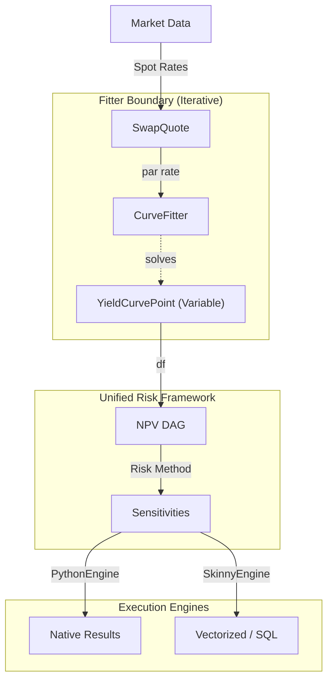

# Market Models & Curve Fitting (pricing/marketmodels/)

This document outlines the curve structural patterns and the **Fitter Boundary**.

## 1. Curves as Reactive Variables
Yield curves (e.g. `LinearTermDiscountCurve`) are composed of a collection of **`YieldCurvePoint`** objects.
- Each `YieldCurvePoint` holds a `fitted_rate` (a primary `@traceable` variable).
- Instruments depend on these points via the curve's `.df(t)` or `.fwd(s, e)` methods.
- The entire curve acts as a symbolic mapping, where differentiating `npv()` w.r.t a point gives the risk.

## 2. Speed over Memory: `_df_cache`
To scale to large portfolios, curves implement an internal `_df_cache`. 
- When 1,000 swaps all request `df(5.0)` at the same time, the curve returns the *same* symbolic `Expr` node.
- This ensures the resulting Portfolio DAG is deduplicated and extremely efficient to differentiate.

## 3. The Fitter Boundary Architecture

The system is split into two distinct zones: the **Iterative Fitter** and the **Symbolic Risk Engine**.

### Flow Pipeline:
1.  **Calibration**: The `CurveFitter` solves for the `fitted_rate` of each pillar such that the benchmark instruments price to par.
2.  **Jacobian Publication**: The fitter publishes its own `∂pillar / ∂quote` sensitivities.
3.  **Chain Rule**: The downstream Unified Risk helpers combine the `∂NPV / ∂pillar` (from the instruments) with the fitter's Jacobian to produce final `∂NPV / ∂quote` risk.

## 4. Short Rate Interpolation
Future implementations will use **Integrated Rate Curves** supporting area-preserving piecewise-linear short rates. This yields smoother forward curves (C¹) while maintaining analytic traceability.
