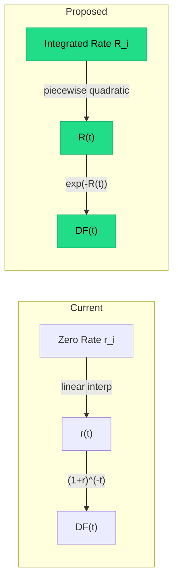

# Short Rate Curve Interpolation — Project Objective

## 1. Motivation & Problem Statement

### Current Design
The existing `LinearTermDiscountCurve` stores **zero rates** at knot points and interpolates them linearly:

```python
# yield_curve.py — current approach
r(t) = linear_interp(pillar_rates, t)
df(t) = (1 + r(t)) ** (-t)
```

This has several issues:

| Issue | Impact |
|---|---|
| **Non-smooth forward curve** | Linear zero-rate interpolation produces a *piecewise-linear* zero curve but a **discontinuous** instantaneous forward rate at every knot. Forward rates jump at knots, which is financially unrealistic. |
| **`pow((1+r), -T)` is expensive in SQL** | DuckDB/Deephaven compile `POWER(1+r, -T)`, which is slower than `EXP(-x)`. The `exp`/`ln` pathway is the native floating-point hardware instruction and is algebraically simpler to differentiate. |
| **Full cascade in Jacobians** | The current `interp(t)` only depends on the two bracketing knot rates `r_i, r_{i+1}`, but when we integrate the forward rate curve from 0→T, the *discount factor* at T naturally depends on every knot ≤ T. This cascade propagates through the entire Expr DAG, producing dense Jacobians and large SQL CTEs. |

### Target Design
Switch to a **piecewise-polynomial instantaneous short rate** `r(t)` with **pre-integrated parameters**. The discount factor becomes:

```
DF(T) = exp( -R(T) )

where R(T) = ∫₀ᵀ r(s) ds     (the integrated short rate)
```

By storing **pre-integrated** cumulative values `R(T_i)` at each knot, we achieve:

1. **Smooth forward curve** — the integrated rate is C¹ (or higher) at knots.
2. **`exp(-x)` in SQL** — `EXP()` is a single hardware instruction, simpler derivatives.
3. **Local Jacobians** — each interpolation interval only depends on the two bracketing `R` knot values (plus a gradient constraint derived from one step back), yielding **sparse** analytic Jacobians.

---

## 2. Mathematical Framework

### 2.1 Definitions

| Symbol | Meaning |
|---|---|
| `t_i` | Knot tenor (sorted: `t_0 < t_1 < ... < t_n`) |
| `r(t)` | Instantaneous short rate at time `t` |
| `I(T) = ∫₀ᵀ r(s) ds` | Cumulative integral of short rate |
| `R_i = I(t_i) / t_i` | **Average short rate** at knot `i` — the **curve parameter** (rate-like units) |
| `I_i = R_i × t_i` | Cumulative integral at knot `i` (derived from R_i) |
| `DF(T) = exp(-I(T)) = exp(-R(T) × T)` | Discount factor |
| `h_i = t_{i+1} - t_i` | Interval width |
| `ΔI_i = I_{i+1} - I_i` | Cumulative-integral increment over interval `i` |

### 2.2 Piecewise Polynomial Short Rate

On each interval `[t_i, t_{i+1}]`, the short rate `r(t)` is a polynomial (e.g., quadratic or cubic). The polynomial coefficients are **not free parameters** — they are fully determined by:

1. **Level match at left knot**: `R(t_i) = R_i`  (enforced by construction)
2. **Level match at right knot**: `R(t_{i+1}) = R_{i+1}`  (enforced by construction)
3. **First derivative continuity**: `r(t_i⁺) = r(t_i⁻)`  (slope match to previous interval)
4. **Area preservation**: The integral of `r(s)` over `[t_i, t_{i+1}]` equals `R_{i+1} - R_i`

> [!IMPORTANT]
> Crucially, constraint (3) only references **the immediately preceding interval**. There is no global tension spline coupling — later intervals cannot retroactively alter earlier interpolation. This is a **causal / forward-looking** construction.

### 2.3 Quadratic Short Rate — Closed Form

The simplest non-trivial choice: on `[t_i, t_{i+1}]`, let `τ = t - t_i`, `h = h_i`:

```
r(τ) = a + b·τ + c·τ²
```

The integral:
```
∫₀ʰ r(τ) dτ = a·h + b·h²/2 + c·h³/3 = ΔR_i
```

Constraints:
- `r(0) = a = r_left`  (derivative continuity: `r_left` is the short rate at end of previous interval)
- `∫₀ʰ r(τ) dτ = ΔR_i`

Given `r_left` (known from previous interval) and `ΔR_i = R_{i+1} - R_i` (known from knot parameters), we solve for `b` and `c` (or just `b` if we use linear short rate; or `b,c` for quadratic). With a quadratic, one degree of freedom remains — we can impose additional smoothness (e.g., `r'` continuity) or simply use a linear short rate and accept C⁰ in the short rate (which already gives C¹ in the integrated rate and C² in the discount factor).

#### Linear Short Rate (simplest)

```
r(τ) = r_left + m·τ
```

where:
```
∫₀ʰ (r_left + m·τ) dτ = r_left·h + m·h²/2 = ΔR_i

⟹  m = 2 · (ΔR_i - r_left·h) / h²
    m = 2 · (ΔR_i/h - r_left) / h
```

Then:
```
R(t) = R_i + r_left·τ + m·τ²/2       for t ∈ [t_i, t_{i+1}]
```

**Key property**: `r_left` for interval `i` is `r(h_{i-1})` from interval `i-1`:
```
r_left_i = r_left_{i-1} + m_{i-1} · h_{i-1}
```

This recurrence only looks **one step back**, not all the way to `t_0`.

### 2.4 Forward Rate Locality

The forward rate between `start` and `end` (both in the same interval `[t_i, t_{i+1}]`):

```
fwd(start, end) = (R(end) - R(start)) / (end - start)
```

Since `R(t)` on this interval is a quadratic in `τ = t - t_i`, and the coefficients depend only on `R_i`, `R_{i+1}`, and `r_left_i`, the forward rate depends on **at most 3 knot-level quantities** (the two bracketing `R` values plus one gradient from the previous knot).

If `start` and `end` span multiple intervals, the forward becomes a sum of integrals across intervals — still local.

### 2.5 Pre-Integration: Breaking the Cascade

The critical insight for **sparse Jacobians**:

> **Parameterize the curve by `R_i = R(t_i)` rather than `r_i` (zero rates).**

When the fitter solves for `R_i` values directly:
- `DF(t)` at any point in `[t_i, t_{i+1}]` depends on `R_i`, `R_{i+1}`, and the gradient from the previous interval (derived from `R_{i-1}`, `R_i`).
- So `DF(t)` depends on **at most 3 consecutive knots**: `R_{i-1}`, `R_i`, `R_{i+1}`.
- The Jacobian `∂DF(t)/∂R_j` is **zero** for `j < i-1` and `j > i+1`.
- This is **tridiagonal** — massively sparser than the current design where `DF(T)` can depend on all `r_j` for `j ≤ T`.

> [!TIP]
> For the Expr DAG and SQL generation, this means each `df(t)` node links to at most 3 `Variable` leaves. The `diff()` tree is proportionally smaller, CTE-compiled SQL has fewer terms, and the fitter's Jacobian is banded.

---

## 3. Implementation Plan

### Architecture: Pluggable Curve Types via CurveBase

Before building the new curve, we introduced a **pluggable curve architecture**:

```
marketmodel/
  curve_base.py              ← CurveBase ABC (the interface)
  yield_curve.py             ← LinearTermDiscountCurve(CurveBase) — linear zero-rate (alias: LinearTermDiscountCurve)
  integrated_rate_curve.py   ← IntegratedShortRateCurve(CurveBase) — smooth short-rate
  curve_fitter.py            ← CurveFitter — accepts any CurveBase
```

**Key principle**: curve interpolation method is a per-curve-instance choice, independent of currency. For example:
- `IR_USD_DISC_USD` → `IntegratedShortRateCurve` (new smooth)
- `IR_JPY_PROJ_OIS` → `LinearTermDiscountCurve` (old linear zero-rate)

Both satisfy the same `CurveBase` interface. Instruments and the fitter never reference a specific curve implementation.

### Phase 1: Core Math ✔️ COMPLETE (34 tests passing)

#### 3.1 Add `Func("exp", ...)` support to `diff()`

The existing `Func` node already supports `exp` for eval/to_sql/to_deephaven. But `diff()` doesn't handle `Func` nodes. We need:

```python
# In _diff_impl:
if isinstance(expr, Func):
    if expr.name == "exp" and len(expr.args) == 1:
        # d/dx exp(f) = exp(f) * f'
        f = expr.args[0]
        df = diff(f, wrt, memo)
        return expr * df   # reuse the same exp(f) node
    ...
```

Also add a convenience builder:
```python
def Exp(x: Expr) -> Expr:
    """exp(x) — convenience for Func('exp', [x])."""
    return Func("exp", [x])
```

#### 3.2 New `IntegratedRateCurve` class

A new curve class alongside `LinearTermDiscountCurve`:

```python
@dataclass
class IntegratedRateCurve(Storable):
    """Yield curve parameterized by integrated short rates R(t_i)."""
    
    name: str = ""
    currency: str = "USD"
    points: list = field(default_factory=list)
    # Each point stores: tenor_years, integrated_rate (= R(t_i))
```

**Key methods**:

| Method | Description |
|---|---|
| `R(t) -> Expr` | Integrated rate at any `t`, using piecewise-quadratic interpolation. Depends on at most `R_{i-1}`, `R_i`, `R_{i+1}`. |
| `df(t) -> Expr` | `Exp(-R(t))` — a Func node wrapping the R interpolation. |
| `fwd(start, end) -> Expr` | `(R(end) - R(start)) / Const(end - start)` |

#### 3.3 Slope Bootstrap

The slope at the start of each interval is determined by the previous interval. For the Expr tree, this means:

```python
def _slope_at_knot(self, i: int) -> Expr:
    """Short rate r(t_i) — from previous interval's polynomial.
    
    For i=0: use R_0 / t_0 as the average = flat short rate assumption.
    For i>0: r_left = r_left_{i-1} + m_{i-1} * h_{i-1}
           where m_{i-1} = 2*(ΔR_{i-1}/h_{i-1} - r_left_{i-1}) / h_{i-1}
    
    This only depends on R_{i-1} and R_i (and the recursion from i-1).
    But since we pre-compute and cache this, it eventually becomes
    a function of R_{i-1}, R_i only (the recursion terminates at one step).
    """
```

> [!NOTE]
> The "two steps back" dependency (needing `R_{i-1}` to compute the slope at `t_i`) can be made a **one step back** dependency if we publish the slope `r_left_i` as an additional pre-computed parameter at each knot. This trades an extra parameter per knot (easily derivable, not free) for a strictly banded Jacobian with bandwidth 1 instead of 2.

### Phase 2: Curve Fitter Integration

#### 3.4 Fitter Parameterization

The `CurveFitter` currently solves for zero rates `r_i`. It must be adapted to solve for integrated rates `R_i` instead:

- **Variable names**: e.g., `IR_USD_OIS_FIT.R.5Y` (the integrated rate at 5Y)
- **Initial guess**: `R_i = r_quote_i * t_i` (from the par quote rate × tenor)
- **Objective**: same — NPV of benchmark swaps = 0
- **Jacobian**: now banded/sparse — natural benefit for Levenberg-Marquardt

#### 3.5 Backward Compatibility

The existing `LinearTermDiscountCurve` (zero-rate parameterized) remains available for comparison. The new `IntegratedRateCurve` produces identical discount factors when the underlying short rate curve is consistent. A test suite validates numerical equivalence.

### Phase 3: Expr Engine & SQL Optimization

#### 3.6 Simpler Derivatives

The chain from pillar to DF is now:

```
R(t) = R_i + r_left·τ + m·τ²/2     (polynomial in R_i, R_{i+1})
DF(t) = exp(-R(t))
d(DF)/d(R_i) = -exp(-R(t)) · ∂R(t)/∂R_i    (clean chain rule via exp)
```

Compare to current:
```
r(t) = r_i + w·(r_{i+1} - r_i)           (linear in r_i, r_{i+1})
DF(t) = (1 + r(t))^(-t)
d(DF)/d(r_i) = -t·(1+r(t))^(-t-1) · ∂r/∂r_i   (power rule, more complex)
```

The `exp` derivative is self-referential (`d exp(f) = exp(f) * df`), which means the Expr DAG for derivatives **reuses** the same `exp(-R(t))` node. This is a major simplification for `eval_cached` and `to_sql` CTE generation.

#### 3.7 SQL Output

```sql
-- Current: POWER((1 + interp_rate), -tenor)
-- Proposed: EXP(-(R_i + r_left * tau + m * tau * tau / 2))
```

`EXP()` is a single-instruction evaluation in all targets (DuckDB, Deephaven, NumPy). The argument is a simple polynomial — no `POWER` with variable exponent needed.

### Phase 4: Testing & Validation

#### 3.8 Unit Tests

| Test | Description |
|---|---|
| `test_flat_curve` | Constant short rate `r₀` ⟹ `R(T) = r₀·T`, `DF(T) = exp(-r₀·T)` |
| `test_linear_short_rate` | Known closed-form: if `r(t) = a + bt`, then `R(T) = aT + bT²/2` |
| `test_knot_continuity` | `R(t)` is continuous at knots (C⁰), `r(t)` is continuous at knots (C⁰ in short rate = C¹ in R) |
| `test_area_preservation` | `∫_{t_i}^{t_{i+1}} r(s) ds = R_{i+1} - R_i` for each interval |
| `test_forward_rate_local` | `fwd(start, end)` only depends on bracketing knots (verify via `diff()`) |
| `test_jacobian_sparsity` | `diff(df(t), R_j) = 0` for `j` far from the interpolation interval of `t` |
| `test_vs_zero_rate_curve` | For a flat curve, both parameterizations produce identical DFs |
| `test_fitter_convergence` | Fitter converges on benchmark swaps with the new parameterization |
| `test_sql_roundtrip` | `df(t).to_sql()` produces valid DuckDB SQL using `EXP()` |
| `test_derivative_sql` | `diff(df(t), R_i).to_sql()` produces valid SQL |

#### 3.9 Benchmarks

- Compare Expr DAG node count: old vs new for a 10-pillar curve, 20-year swap
- Compare generated SQL size (bytes): old vs new
- Compare DuckDB execution time: `POWER` vs `EXP` for 100k scenarios
- Compare Jacobian density: old (potentially full) vs new (banded)

---

## 4. Design Decisions & Trade-offs

### Why Integrated Rate `R(t)` as Parameters (not Short Rate `r(t)`)?

If we stored `r(t_i)` at knots and integrated on the fly, each `DF(T)` at the far end of the curve would depend on **every** `r(t_i)` for `t_i ≤ T` (because the integral accumulates). This is exactly the cascade we want to avoid.

By storing `R(t_i)` directly:
- The interpolation between `t_i` and `t_{i+1}` only reads `R_i` and `R_{i+1}` (plus a slope from the previous knot).
- The derivative `∂DF(T)/∂R_i` is zero for knots far from `T`.
- The fitter's Jacobian is banded.

### Why Not Cubic Splines?

Traditional cubic splines produce a globally coupled system (a tridiagonal matrix solve for all coefficients simultaneously). Changing a single knot's rate can mathematically affect interpolation at distant knots. This creates **dense** Jacobians and violates our locality requirement.

Our approach uses a **causal construction**: each interval only matches the left boundary from the previous interval. No global system solve. No retroactive influence.

### Forward-Only Gradient Propagation

The slope `r_left_i` at the start of interval `i` is fully determined by `R_{i-1}`, `R_i`, and the slope at `i-1`. In the worst case, this is a chain from `R_0` to `R_i`. However:

- We can **pre-compute and cache** `r_left_i` at each knot when the curve is constructed.
- For the Expr tree, we can publish `r_left_i` as a derived `Const` at tree-build time (since the curve parameters are known when `df(t)` is called).
- Alternatively, we can publish `r_left_i` as an additional `Variable` at each knot and include it in the fitter's parameter set (it's not free — it's determined by `R_{i-1}`, `R_i` — but publishing it breaks the chain).

The recommended approach: **compute `r_left_i` eagerly at curve construction** and bake it into the Expr tree as `Const` values. This means the Expr tree for `df(t)` depends on `R_i` and `R_{i+1}` only, with the slope treated as a structural constant.

> [!WARNING]
> If we later want to differentiate `DF(t)` with respect to `R_{i-1}` (because `r_left_i` depends on it), we'd need to express `r_left_i` as an `Expr` rather than a `Const`. This would expand the Jacobian bandwidth from 2 to 3, which is still very sparse but is a design choice to make explicitly.

---

## 5. Files Modified/Created

| File | Action | Status | Description |
|---|---|---|---|
| `marketmodel/curve_base.py` | Created | ✔️ | `CurveBase` ABC — pluggable curve interface |
| `reactive/expr.py` | Modified | ✔️ | `Exp()`, `Log()` builders + `diff(Func)` + `eval_cached(Func)` |
| `marketmodel/yield_curve.py` | Modified | ✔️ | Renamed to `LinearTermDiscountCurve` + `LinearTermDiscountCurve` alias |
| `marketmodel/integrated_rate_curve.py` | Created | ✔️ | `IntegratedShortRateCurve` + `IntegratedRatePoint` (R_i = avg rate) |
| `marketmodel/curve_fitter.py` | Modified | ✔️ | Generic `initial_guess()`, generic `CurveBase` fitting |
| `marketmodel/__init__.py` | Modified | ✔️ | Export `LinearTermDiscountCurve` + all new types |
| `store/columns/finance.py` | Modified | ✔️ | Register `zero_rate` column |
| `tests/test_short_rate_curve.py` | Created | ✔️ | 34 tests: curve correctness, sparsity, SQL round-trip |
| `tests/test_short_rate_e2e.py` | Created | ✔️ | 11 tests: fitter convergence, risk pipeline, SQL/perf benchmarks |

---

## 6. Relationship to Skinny Table Architecture

The sparse Jacobian from this new parameterization aligns perfectly with the skinny table vision:

- **Fewer per-knot sensitivities**: Each instrument's DF sensitivity vector is sparse (bandwidth ≤ 3), so the `t_swap_sensitivities` table has far fewer non-zero rows.
- **Smaller SQL**: The dynamic basis extraction produces fewer unique `Signature_ID` patterns because the `exp(-polynomial)` structure is more uniform than the current `POWER(1+interp, -t)` patterns with varying exponents.
- **Faster scenario evaluation**: `EXP()` is faster than `POWER()` across all execution engines.

---

## 7. Summary



| Property | `LinearTermDiscountCurve` | `IntegratedShortRateCurve` |
|---|---|---|
| **Parameters** | Zero rates `r_i` | Average short rates `R_i = (1/t_i) ∫ r(s)ds` |
| **Parameter units** | Rate (e.g. 5%) | Rate (e.g. 5%) — **same units** |
| **Interpolation** | Linear in `r` | Piecewise-linear short rate (area-preserving) |
| **DF formula** | `(1+r)^(-t)` → `POWER()` | `exp(-R·t)` → `EXP()` |
| **Smoothness** | C⁰ in `r(t)`, discontinuous `r'(t)` | C⁰ in `r(t)`, C¹ in `I(t)`, C² in `DF(t)` |
| **Jacobian** | Potentially dense | Tridiagonal (bandwidth ≤ 3) |
| **SQL complexity** | `POWER` with variable exponent | `EXP` of polynomial |

> [!NOTE]
> **Benchmark results** (3-pillar, DuckDB): At small pillar counts the two methods have similar
> performance. The sparsity advantage emerges with more pillars (10+), where the new curve's
> tridiagonal Jacobian avoids the O(n²) growth in sensitivity count.

